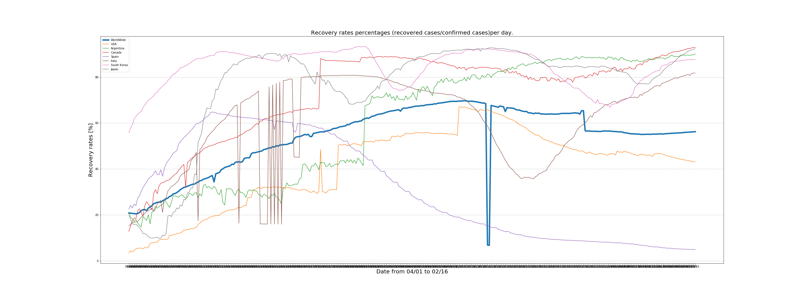
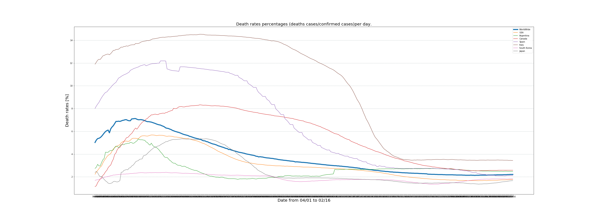
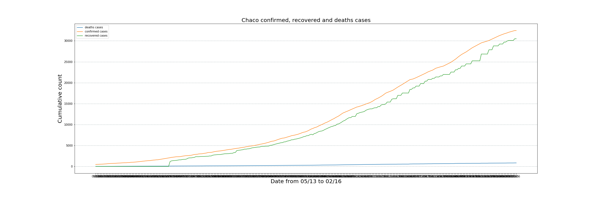

# Covid19_Data
### Project to track covid19 infections for Argentina, Chaco province, USA and Worldwide.
## Data source
Data publish daily from Bing:
https://raw.githubusercontent.com/microsoft/Bing-COVID-19-Data/master/data/Bing-COVID19-Data.csv

## Charts published by Bing
https://www.bing.com/covid?form=C19WID&vert=graph

## The graphs below show trends that are not widely available
### Trend showing recovery rates Worldwide and some countries

### Trend showing death rates Worldwide and some countries

### Trends from Argentina and Chaco province

